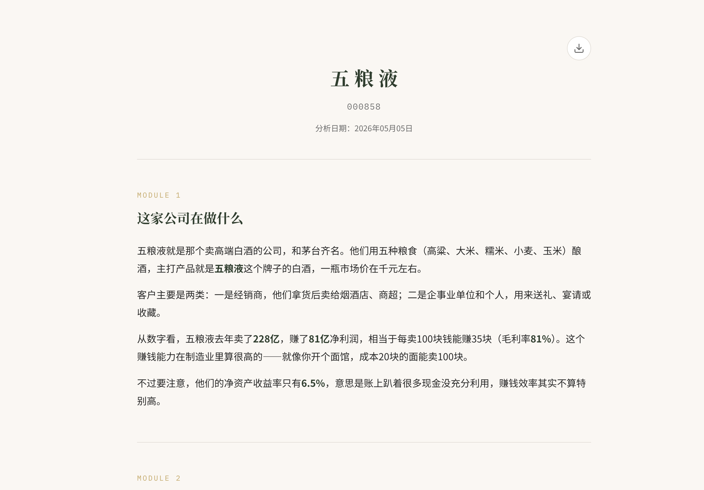
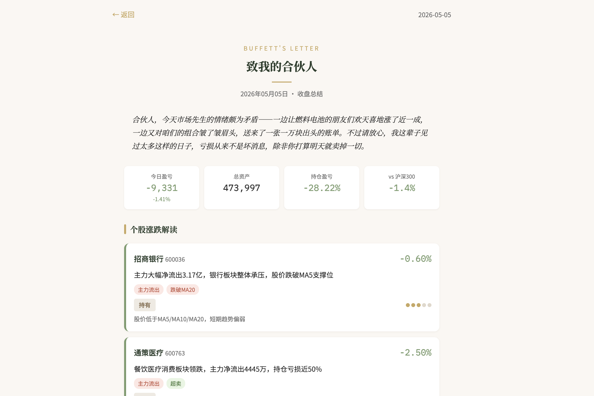
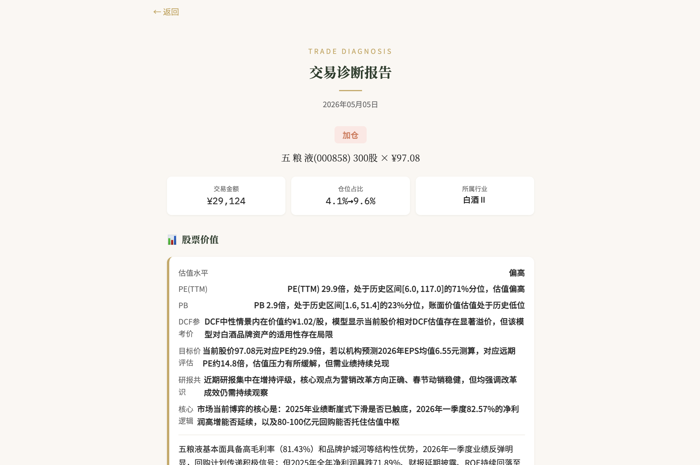
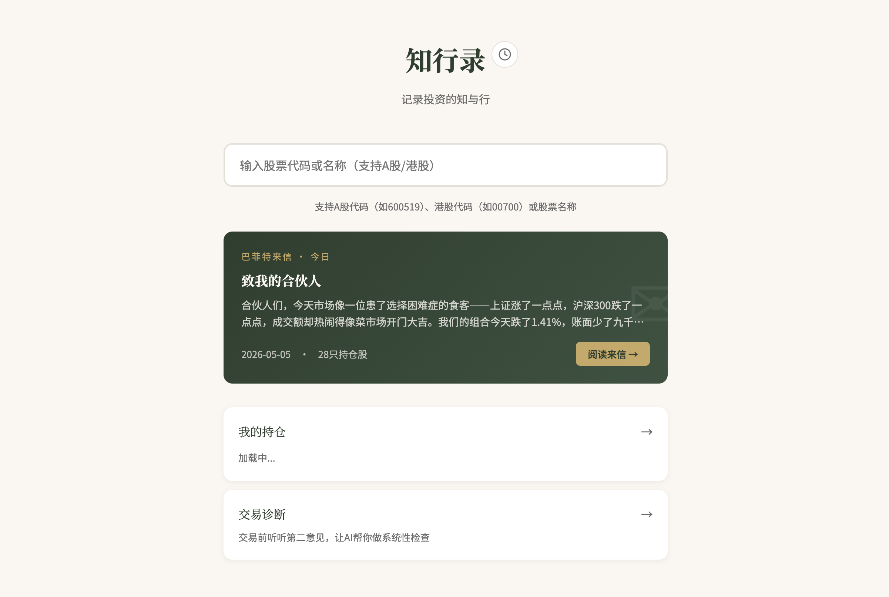

<div align="center">

# 知行录

### AI 驱动的投资思考伙伴

**不做预测，只做分析。帮你看清每一笔交易背后的逻辑。**

[](LICENSE)
[](https://www.python.org/)
[](https://fastapi.tiangolo.com/)

[官网](https://firyrice.github.io/zhixinglu/) · [快速开始](#快速开始) · [功能演示](#功能演示) · [B站频道](https://space.bilibili.com/117762790?spm_id_from=333.788.0.0)

</div>

---

## 为什么做这个项目？

散户投资有三个致命问题：**研究不深、盯盘焦虑、冲动交易**。

市面上的工具要么太专业（Bloomberg Terminal），要么太浅（各种炒股 App 的资讯流）。我认为现阶段 SOTA AI 模型的投研能力已经远超大部分散户甚至金融从业者，只是缺少一个好用的产品把这个能力释放出来。

知行录就是这样一个工具——把 AI 的深度分析能力，包装成散户真正用得上的三个功能：

| 痛点 | 知行录的解法 |
|------|-------------|
| 不会做研究，看了一堆消息抓不住重点 | **个股深度分析**：10 维度研报，一键生成 |
| 没时间盯盘，涨了不知道卖、跌了就慌 | **巴菲特来信**：每日一封 AI 持仓诊断 |
| 买卖凭感觉，事后总后悔 | **交易诊断**：下单前 6 维度系统检查 |

## 功能演示

### 个股深度分析

输入股票代码，一键生成覆盖 10 大维度的全方位研报。从"这家公司在做什么"到"该不该买"，用人话把复杂的财务数据讲清楚。



<details>
<summary>10 个分析模块详情</summary>

| 模块 | 内容 |
|------|------|
| 这家公司在做什么 | 业务概览，AI 生成的通俗介绍 |
| 它怎么赚钱 | 商业模式与盈利结构 |
| 财务体检 | 营收、利润、ROE 趋势 + 可交互 DCF 估值 |
| 估值坐标 | 5 种经典估值 + PE/PB 历史分位 |
| 最新研报 | 券商观点摘要 + 盈利预测 |
| 市场分歧 | 多空观点梳理 |
| 股价走势 | 90 日 K 线 + AI 技术解读 |
| 财报附录 | 最新公告索引 |
| 交易参考 | 数据驱动的买卖框架 |
| 延展问题 | AI 生成的深度思考题 |

</details>

### 巴菲特来信（每日持仓诊断）

每天收盘后，基于你的实际持仓，以巴菲特的口吻写一封专属分析信。涵盖持仓涨跌解读、热点情报、市场研判、风险体检和操作建议。



### 交易诊断

买入还是卖出？下单前先让 AI 做个系统检查。输入交易意图，从价值、仓位、时机、市场、板块、风险 6 个维度给出诊断，还支持追问对话。



### 持仓追踪

券商截图一键导入持仓（VLM 智能识别），实时盈亏计算，行业/市值/估值/股息多维穿透分析。



## 快速开始

### 3 步跑起来

```bash
# 1. 克隆并安装
git clone https://github.com/firyrice/zhixinglu.git
cd zhixinglu
pip install -r requirements.txt

# 2. 配置 API Key
cp .env.example .env
# 编辑 .env，填入你的 LLM API Key

# 3. 启动
python3 run.py
# 打开 http://localhost:5001
```

### 环境要求

- Python >= 3.11
- 一个 OpenAI 兼容的 LLM API

### API 配置

编辑 `.env` 文件：

```env
# LLM：用于生成分析报告（支持任何 OpenAI 兼容接口）
LLM_BASE_URL=https://api.openai.com/v1
LLM_API_KEY=your-api-key-here
LLM_MODEL=gpt-4o

# VLM：用于持仓截图识别（需要支持图片输入的模型）
VLM_BASE_URL=https://api.openai.com/v1
VLM_API_KEY=your-api-key-here
VLM_MODEL=gemini-3.1-pro
```

支持的 LLM 服务商：

| 服务商 | LLM_BASE_URL | LLM_MODEL |
|--------|-------------|-----------|
| OpenAI | `https://api.openai.com/v1` | `gpt-4o` |
| Anthropic | `https://api.anthropic.com/v1` | `claude-sonnet-4-6` |
| DeepSeek | `https://api.deepseek.com` | `deepseek-chat` |
| 本地 Ollama | `http://localhost:11434/v1` | `qwen2.5:72b` |

> 项目通过 OpenAI SDK 调用，任何兼容 OpenAI API 格式的服务都可以直接使用。

## 技术栈

| 层 | 技术 |
|----|------|
| 后端 | FastAPI + uvicorn |
| 数据源 | [akshare](https://github.com/akfamily/akshare)（A股/港股行情、财务、研报） |
| 估值引擎 | [valueinvest](https://github.com/wangzhe3224/valueinvest) + 自研 DCF |
| AI | OpenAI SDK（兼容任意 OpenAI 格式的 LLM/VLM） |
| 前端 | 原生 HTML/JS SPA + [ECharts](https://echarts.apache.org/) |
| 存储 | SQLite（零配置） |

## 项目架构

```
zhixinglu/
├── run.py                      # 入口
├── app/
│   ├── main.py                 # FastAPI 路由
│   ├── ai/                     # LLM/VLM 调用 + Prompt 工程
│   ├── data/                   # akshare 数据层（行情、财务、新闻）
│   ├── models/                 # SQLite 持久化
│   ├── report/                 # 报告生成器 + HTML 模板
│   └── static/                 # 前端 SPA
├── website/                    # 官网（独立静态站）
└── PRD/                        # 产品文档
```

**数据流**：用户输入 → 并发获取 11 个数据源 → 10 个 AI 分析模块顺序执行 → HTML 流式渲染到浏览器

## 参与贡献

欢迎 PR 和 Issue！无论是修 bug、加功能、优化 prompt，还是分享你的投资分析思路，都非常欢迎。

如果这个项目对你有帮助，请给个 Star 支持一下。

## 联系方式

- **B站**：[蛋炒饭财经](https://space.bilibili.com/117762790?spm_id_from=333.788.0.0)（产品更新、使用教程）
- **邮箱**：1197846710@qq.com

## 免责声明

本工具生成的分析报告仅供学习和参考，不构成任何投资建议。股市有风险，投资需谨慎。

## License

MIT

